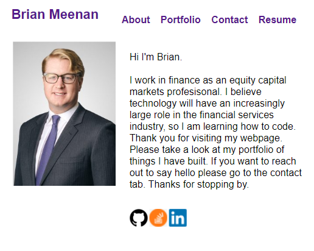

# Portfolio Webpage
  
   
  
  ## Table-of-Contents

  * [Description](#description)
  * [Installation](#installation)
  * [Use](#use)
  * [License](#license)
  * [Contributing](#contributing)
  * [Tests](#tests)
  * [Questions](#contact)
  
  ## [Description](#table-of-contents)

  This is my personal webpage with select projects I worked on and and a section to contact me

  [Link to the website](https://brian-lets-go.github.io/Brians-Portfolio/)

  
 
  ## [Questions](#table-of-contents)
  Please contact me using the following links:
  [GitHub](https://github.com/Brian-Lets-Go)
  [Email: brian.w.meenan@gmail.com](mailto:brian.w.meenan@gmail.com)
